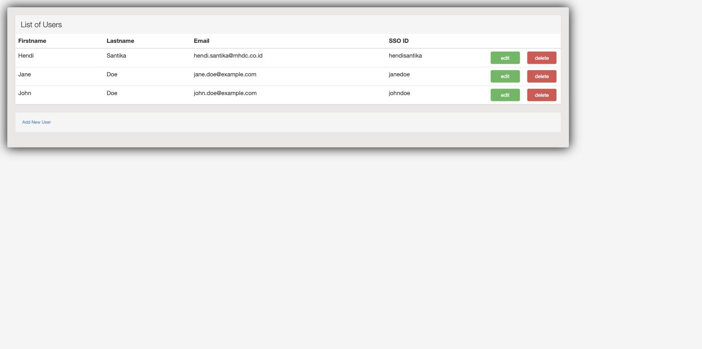

# SpringMVCHibernateManyToManyCRUDExample

A simple CRUD application demonstrating a Many-To-Many relationship between `User` and `UserProfile`
entities, built with Spring MVC and Hibernate.

## Tech Stack

- Java 25
- Spring Framework 7
- Hibernate ORM 7
- MySQL 8
- Jetty 12 (EE10) / JSP + JSTL
- Maven

## Domain Model

- **APP_USER** — a user, who can have several profiles (`USER`, `ADMIN`, `DBA`).
- **USER_PROFILE** — a profile, which can be linked to several users.
- **APP_USER_USER_PROFILE** — the join table linking `APP_USER` and `USER_PROFILE` in a
  Many-To-Many relationship.

## Running Locally

1. Create a MySQL user/database matching `src/main/resources/application.properties`
   (the database is auto-created on first connect).
2. Load the schema and seed data:
   ```bash
   mysql -u root -p < src/main/resources/websystique.sql
   ```
3. Run the app with the Jetty Maven plugin:
   ```bash
   mvn jetty:run
   ```
4. Open [http://localhost:8080/SpringMVCHibernateManyToManyCRUD/list](http://localhost:8080/SpringMVCHibernateManyToManyCRUD/list)

## Screenshot


